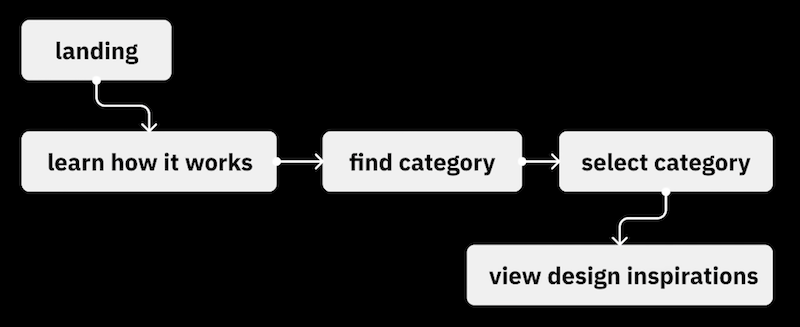

# Week 11A

## I. Project 3: Interactive Digital Prototype
- [Project 3: Interactive Digital Prototype - Putting the team together](../documents/p3-put-team-together.md)
- [Project 3 - Interactive Digital Prototype - deliverable #1 - Work Plan, Features & Personas](../documents/p3-work-plan.md)
- [Project 3 Teams](../documents/p3-teams.md)
  - everyone on a team?
  - all teams have an app idea, list of features, 3 personas?
- [Project 3 - Interactive Digital Prototype - deliverable #2 - Lo-Fi mockups and in-class testing](../documents/p3-lofi-deliverable.md)
  - due prior to start of class 11A - see myCourses dropbox for exact time

---

## II. User Personas

- Let's take a peak at some of the user personas you came up with for your app prototypes
- BTW - although we went with a "lean" process for personas in this class, without any real research other than the imagination of you and your teammates, personas are commonly much more visual and lean heavily on robust industry marketing research
- IGM students will revisit user personas in *IGME-236 Experience Design for Games & Media*
- To your edification, below is a little more about personas ...

---

### IMPORTANT - What Makes a Professional Persona?

Personas in the UX industry are **visual documents**, not just text. Each persona should include:

**❌ BAD Example (Text Only - Unprofessional):**
> "Sarah, 20, college student. Needs to organize her schedule."

**✅ GOOD Example (Visual Persona Document):**

**Each persona document must include:**

**Visual Elements:**
- A realistic photo (use stock photos from [Unsplash](https://unsplash.com), [Pexels](https://www.pexels.com), or [Generated Photos](https://generated.photos))
- Clean, organized layout (can be created in Canva, Figma, PowerPoint, or Photoshop)

**Required Information:**
- **Name & Basic Demographics:** Age, occupation, location
- **Background/Bio:** Brief description of their life situation and context
- **Goals:** What they want to accomplish (2-4 bullet points)
- **Frustrations/Pain Points:** Current problems they face (2-4 bullet points)
- **Tech Comfort Level:** How comfortable are they with technology?
- **Quote:** In their own words - what would they say about the problem? (1-2 sentences)
- **Scenarios:** When/why/how would they use your app? (brief description)

**Pro Tip:** Look at real persona examples from the resources above to see how professional UX designers present this information visually.
  

---

## III. User Flow 
- This is step #1 from the [UI/UX Design Process Overview](10B.md#iii-uiux-design-process-overview) from last time
- For deliverable #2, you are going to look at each user persona
  - the *primary user*, *power user* and *casual user*
  - and think about the most common tasks each user will want to perform
  - and write them down
- you will then create user flow diagrams for each user - at least 3 for your *primary user*, and at least one more each for your *power user* and *casual user*
  - that adds up to a minimum of FIVE unique user flow diagrams
- Your (simplified, high-level) user flow diagrams need:
  - a *title* that explains the user action (ex. "Change shock intensity")
  - an *entry point* (ex. "App Home Screen")
  - a *series of steps* the user will need to take (ex. ***"Find Settings Button"*** ➡️ ***"Navigate to Settings Screen"*** ➡️ ***"Change Intensity to Desired Level"***)
  - an *end success state* (ex. "Confirm Change")
 
- For our purposes, a simplified version like this is fine:

---

#### \*\*\* IMPORTANT - USER FLOW DIAGRAMS ARE OFTEN MORE FINE-GRAINED AND DETAILED ... \*\*\*

- and reflect decision points and error states
  - https://www.flowmapp.com/features/user-flow-diagram-examples
  - https://www.uxdesigninstitute.com/blog/design-user-flows-with-examples/

---

## IV. Wireframing

- TODO

---

## V. Why User Testing?

- [Study Guide 11: User Testing](https://docs.google.com/document/d/1f5h_8OBTGzORzFFOK5QamQqt4XgW4_Xe_ERmpZ9bmU0/edit?usp=sharing)

---

## VI. Scenario-Based Usability Testing
- Let's translate our User Flow diagrams into user tests
- TODO
 
---

## VII. 

---
---

| <-- Previous Unit | Home | Next Unit -->
| --- | --- | --- 
|   [**Week 10B Notes**](10B.md)  |  [**IGME-110 Home**](../) | Week 11B Notes
