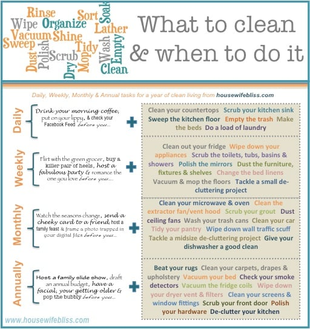
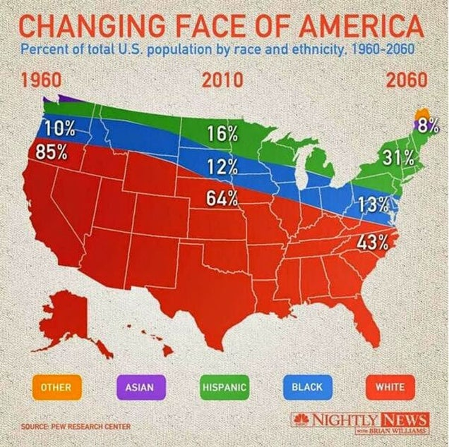
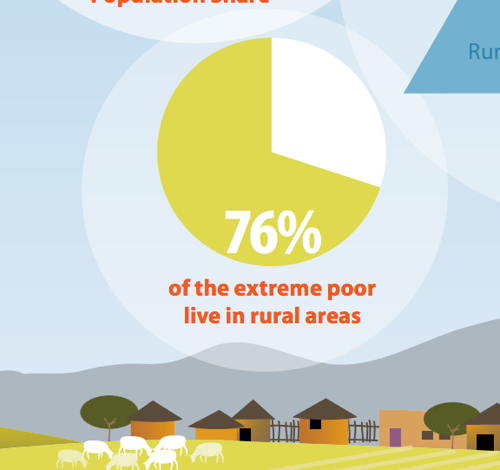
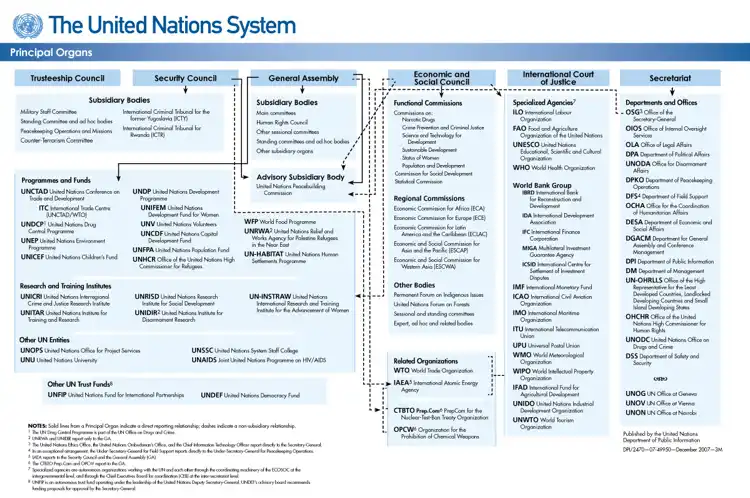
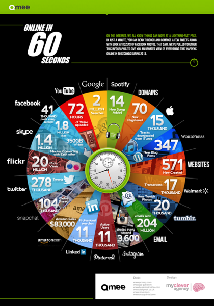
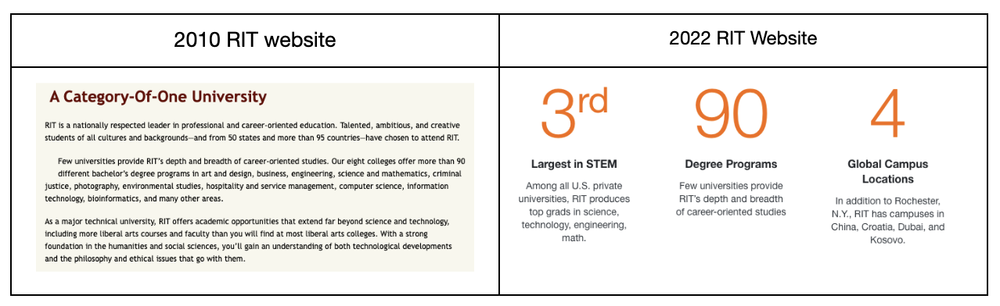

# 8B Notes

## I. C.R.A.P. Principles

### Why Use CRAP Design Principles? (from https://attentioninsight.com/crap-design-principles/)
- CRAP design principles are important because they provide guidance on how to create visual designs that are effective and pleasing to the eye:
  - ***Contrast*** is important because it helps to create visual interest and to highlight important elements;
  - ***Repetition*** helps to create a sense of unity and to reinforce the overall message;
  - ***Alignment*** ensures that elements are placed in a logical and cohesive manner;
  - ***Proximity*** helps to group related elements and emphasize relationships between them.

---

## II. Critiquing some infographics!

- ***What are your thoughts on these??***

---

---

---

---

---

-  Used the [Wayback Machine](https://web.archive.org/web/20100101000000*/https://www.rit.edu/) for this one:

---

## II. In-class Activity
- Infographic Mockup - Critique
  - While referring to the project 2 rubric (linked below), offer feedback to at least 3 of your classmates
  - Also look for:
    - Spelling and grammar issues
    - Are the font choices appropriate? How many fonts are there?
    - Is the text readable and is there enough contrast?
    - Do the colors work together?
    - Do the icons/images and associated text work together?
    - Are elements too close together, or too far apart?
    - Does the infographic feel cluttered with too many elements or too much information?
   - Some Design Principles to consider:
     - *Visual Hierarchy* - helps show order of importance among elements (ex. Title/Heading/Subheading/Body)
     - *Contrast* - helps distinguish elements and makes them readable and accessible
     - *Balance* - helps moderate the spacing, alignment or placement of different elements
     - *Consistency* - Helps keep element harmonica and avoids user confusion
  - Overall:
    - Do you think the overall graphic will *resonate with*/*persuade* the target audience?
- ***I will take attendance towards the end of class, and that's how you will get credit for the critique and your mockup***
- Infographic Final Rubric is here --> [p2-Infographic-Rubric.pdf](../documents/p2-Infographic-Rubric.pdf)

--- 

## III. Upcoming HW

- [Project 2: Infographic - Final Version](../documents/p2-final.md)
  - see dropbox in myCourses
- [Week 9 Study Guide: Introduction to Figma & Interaction Design](https://docs.google.com/document/d/1nlwsaJXJozfZu4VocByOHxetIghnsTwGtABZgRNFOCc/edit?usp=sharing)
  - see dropbox in myCourses

---
---

| <-- Previous Unit | Home | Next Unit -->
| --- | --- | --- 
|   [**Week 8A Notes**](8A.md)  |  [**IGME-110 Home**](../) | [Week 9A Notes
